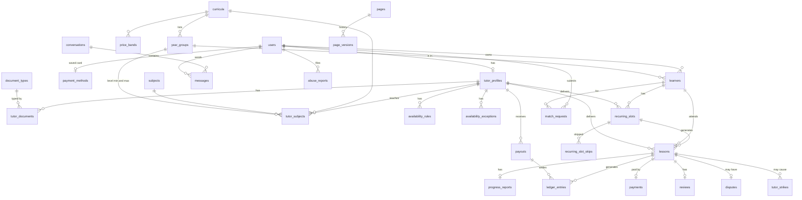

# DATA MODEL — v1.5

_All money columns are integer fils (AED). All timestamps UTC unless stated. Soft deletes only where noted._
_v1.2 (owner ruling 2026-09-17, PRD §12): adds `pages` + `page_versions`, `content_blocks`, `document_types`, `payment_gateways`, `video_providers`; `settings` gains a `group`; `tutor_profiles` gains bank details and `agreement_version`; `tutor_documents.type` becomes a foreign key. Encrypted columns use Laravel's `encrypted` cast and are never exposed unmasked._
_v1.3 (cycle 03, rulings R32–R36, ADR-004; describes what shipped): adds `year_groups` — year group becomes a controlled list per curriculum (R33), so `learners` and `tutor_subjects` point at it and keep their old free text only in `*_legacy` columns; `tutor_profiles` gains `submitted_at` and the status lifecycle is one table of allowed edges (R36); `content_blocks` also carries the match-request budget labels (R35); `TutorProfile::displayName()` is the one public name (R32)._
_v1.4 (cycle 04, CP3 3b/3c, R57; describes what shipped): three real schema deviations from v1.3's forward-looking design, plus one implementation-detail note, all called out inline below. `lessons` gains its CP3 columns exactly as v1.3 specified (money frozen at booking, room/completion/cancellation fields); `tutor_strikes` built as speculated. Schema deviation 1 — overlap protection is now two constraints, not one, see "Overlap protection" under `### lessons`. Schema deviation 2 — `payments.lesson_id` is UNIQUE, see `### payments`. Schema deviation 3 — `ledger_entries.account` gains a `gateway` value, the external counter-leg for money entering/leaving escrow, not in v1.3's enum list, see `### ledger_entries` and the corrected Ledger-effect table under `### lessons`. Implementation-detail note — `ledger_entries` enforces append-only with a DB-level `BEFORE UPDATE OR DELETE` trigger, not just application discipline, see `### ledger_entries`; this was always the stated design (the table's v1.3 prose already said "append-only"), so it is not counted as a schema deviation._
_v1.5 (cycle 05, CP4+ sub-cycle 4a, R92/R95/R98/R99/R100; describes what shipped in 4a — 4e's `payments` changes are added when 4e ships): `recurring_slots` gains its full CP4 column set plus `price` (R95, frozen on the slot); the slot uniqueness index now covers paused slots (R99); `lessons` gains a recurring-key unique index whose predicate deviates from R98's wording (Deviation A below); `recurring_slot_skips` is new (R98); `payment_methods` is described as built, and its FK from `lessons.payment_method_id` lands in 4a rather than 4e (Note B below). Schema deviation A — `lessons_recurring_slot_starts_at_unique` excludes pause-cancelled rows, see `### lessons`. Note B — `payments.payment_method_id` (if the column is added) still goes with 4e._

## ERD


_Registry and content tables without relations: `settings`, `content_blocks`, `payment_gateways`, `video_providers`, `audit_logs`._

## Tables

### users
`id, role (enum: account_owner|tutor|admin), name, email (unique), phone, timezone (default Asia/Dubai), password, email_verified_at, status (active|suspended), suspended_reason, last_login_at, timestamps, deleted_at`

### learners
`id, account_user_id (fk users), display_name, is_minor (bool), year_group_id (fk year_groups, nullable, restrict on delete), year_group_legacy (string, nullable — the pre-v1.3 text, kept only for rows the migration could not map), curriculum_id (fk), school (nullable), notes (text), timestamps, deleted_at`
- `year_group_id` must belong to `curriculum_id` (validated in the Form Requests; a change of curriculum needs a new year group). `year_group_legacy` is read only to show a parent or tutor what to re-pick; nothing filters on it.
- An adult student has one learner row with `is_minor=false` and `display_name` = their own name.

### payment_methods
`id, account_user_id (fk → users, unique — one card in v1), gateway, gateway_customer_ref, gateway_token, brand, last4, exp_month, exp_year, status (active|expired|failed, default active), last_failed_at, timestamps`
- Never store PAN. Token only. The model hides `gateway_token` from serialisation (invariant 15).
- v1.5 (as built): `lessons.payment_method_id` is a real foreign key to this table (`restrictOnDelete`), added by the same 4a migration that creates the table. `payments.payment_method_id` is added with 4e.

### tutor_profiles
`id, user_id (fk, unique), headline, bio, intro_video_url, hourly_rate (fils), status (enum: draft|pending_review|changes_requested|approved|rejected|suspended), submitted_at (nullable timestamp — set at every submit for review, backfilled from `created_at` for non-draft rows; the approval queue sorts on it), permit_number, permit_expires_at (date), agreement_accepted_at, agreement_version (int, nullable — the `pages.version` of `tutor_agreement` accepted), bank_name (encrypted), bank_account_name (encrypted), bank_iban (encrypted), bank_swift (encrypted, nullable), bank_verified_at, rating_avg (decimal), rating_count, lessons_completed, late_report_count_90d, strike_count_90d, review_note (admin → tutor), approved_by (fk users), approved_at, timestamps`
- **Bookable** = `status = approved AND permit_expires_at > today`. Expose as a query scope `bookable()`; never re-implement the condition. `permitIsValid()` is its one PHP twin (same rule, by date), used by approval and reinstatement.
- **Status edges (R36)** live in one table, `App\Services\Tutors\TutorStatusTransitions`, and every status change goes through its `transition()` (a transaction on a `lockForUpdate` row; events dispatched after commit): draft → pending_review; pending_review → approved | changes_requested | rejected; changes_requested → pending_review | changes_requested | rejected; approved → suspended | changes_requested; suspended → approved | changes_requested (only via `ReinstateTutor`); rejected → none. Approval and reinstatement re-check the permit, every required document accepted, and the rate inside the current price band.
- **`displayName()`** (R32) is what any public page or parent email calls the tutor: the first word of `users.name`; admin screens keep the full name.
- v1.2 drops the per-document `*_verified_at` columns: verification lives on `tutor_documents.status` per document type. Approval requires every `document_types.required` row to have an `accepted` document (code, CP1).
- Bank fields are shown masked (last four of the IBAN) everywhere except the payout CSV generated by an admin.

### tutor_documents
`id, tutor_profile_id, document_type_id (fk document_types), disk_path (private), original_name, status (pending|accepted|rejected), reviewed_by, reviewed_at, timestamps` · unique (tutor_profile_id, document_type_id) for the current document; superseded uploads keep history via soft delete.

### document_types
`id, code (permit|id|qualification|police_clearance|… — a lowercase slug, unique, immutable once created), name, description (shown to the tutor), required (bool), active (bool), sort, timestamps`
- Seeded with the four defaults; managed in Filament. The permit remains a first-class field on `tutor_profiles` (number + expiry drive `bookable()`); its scan is a document type like the others.

### curricula
`id, code (GCSE|A_LEVEL|IB_MYP|IB_DP|CBSE), name, sort`

### subjects
`id, name (Mathematics, Physics, English Language, …), slug, sort`

### tutor_subjects
`id, tutor_profile_id, curriculum_id, subject_id, level_min_id (fk year_groups, nullable, restrict), level_max_id (fk year_groups, nullable, restrict), level_min_legacy (string, nullable), level_max_legacy (string, nullable), level_tier (enum: lower_secondary|exam_1|exam_2 — derived from the year-group range, never taken from the client)` · unique (tutor, curriculum, subject)
- A row with a null `level_min_id`/`level_max_id` is an unmapped legacy row: a draft or changes-requested tutor is sent back to the subjects step to re-pick; an approved tutor's unmapped row is permissive in search until the tutor is re-vetted.

### year_groups
`id, curriculum_id (fk curricula, restrict), code, label, sort (smallint, max 32767), level_tier (enum: lower_secondary|exam_1|exam_2), timestamps` · unique (curriculum_id, code) · unique (curriculum_id, label) · index (curriculum_id, sort)
- Seeded from one source (21 rows: GCSE, A Level, IB MYP, IB DP, CBSE); managed in Filament (admin only, audited; curriculum fixed after creation; delete hidden while any learner or tutor subject references it). Editing `level_tier` or `sort` re-derives the stored `tutor_subjects.level_tier`, with one audit row. `LegacyYearGroupMapper` maps old text onto a row by trimmed, whitespace-collapsed, case-insensitive exact label; anything else stays in the `*_legacy` column.

### price_bands
`id, curriculum_id, level_tier, min_rate (fils), max_rate (fils), effective_from` · unique (curriculum, tier, effective_from)

### availability_rules
`id, tutor_profile_id, weekday (0–6), start_time, end_time, timezone`  — weekly template in tutor local time; converted to UTC when computing slots

### availability_exceptions
`id, tutor_profile_id, date, start_time, end_time, type (blocked|extra)`

### recurring_slots
```
id, learner_id, tutor_profile_id, curriculum_id, subject_id,
price (fils, unsigned bigint — agreed once at creation, R95),
weekday (0–6), start_time (local), timezone,
starts_on (date), ends_on (date, nullable),
status (enum: active|paused|ended),
paused_reason (nullable: payment_failed|admin), ended_by_user_id, ended_at, end_effective_on,
consecutive_charge_failures (int),
generated_until (date, NOT NULL),
created_by_user_id, timestamps
```
- **v1.5:** unique partial index `recurring_slots_live_unique` on `(tutor_profile_id, weekday, start_time, timezone) WHERE status IN ('active','paused')` — replaces v1.4's `recurring_slots_active_unique` (`WHERE status = 'active'`), so a paused slot keeps its place and resume can never collide (R99). `ended` slots hold nothing.
- An `active` or `paused` slot blocks that weekday/time in `SlotCalculator` indefinitely, not just up to `generated_until`; an `ended` slot blocks nothing (R97).
- **Effective end** of a slot = the earlier of `ends_on` and `end_effective_on`, both inclusive; null = open-ended (`RecurringSlot::effectiveEndDate()`).
- `price` is the regular price frozen when the slot is created; each generated lesson copies it and freezes its own commission and policy fields at generation (R95, invariants 6 and 11). The 4a migration refuses to run if `recurring_slots` already has rows (there were none, locally or on rehearsal).

### recurring_slot_skips
```
id, recurring_slot_id (fk), starts_at (utc), reason (enum: lesson_collision|tutor_blocked|tutor_unavailable),
notified_at (nullable), timestamps
```
- Unique `(recurring_slot_id, starts_at)`. Written by `recurring:generate` (4c) for an occurrence it could not create; `notified_at` makes the parent's email idempotent (R98). New in v1.5.

### lessons
```
id, type (enum: trial|regular), recurring_slot_id (nullable),
learner_id, tutor_profile_id, booked_by_user_id, curriculum_id, subject_id,
starts_at (utc), ends_at (utc), duration_minutes (=60),
price (fils), commission_pct (frozen), commission_amount, tutor_amount,
cancel_window_hours (frozen), student_grace_min (frozen), tutor_grace_min (frozen),
status (enum — see state machine),
payment_method_id (nullable), charge_attempts (int), next_charge_at (nullable),
room_provider, room_id, tutor_join_url, learner_join_url, room_created_at,
tutor_joined_at, learner_joined_at, room_closed_at,
completed_at, cancelled_at, cancelled_by_user_id, cancel_reason,
report_due_at, escrow_released_at,
timestamps
```
- Indexes: `(tutor_profile_id, starts_at)`, `(learner_id, starts_at)`, `(status)`, `(report_due_at)`, `(next_charge_at) WHERE status = 'reserved'`.
- **v1.5, Deviation A — recurring idempotency key:** `lessons_recurring_slot_starts_at_unique`, `UNIQUE (recurring_slot_id, starts_at) WHERE recurring_slot_id IS NOT NULL AND cancel_reason IS DISTINCT FROM 'slot_paused'` (Postgres `IS DISTINCT FROM`, because `cancel_reason` is nullable text). R98 specified `WHERE recurring_slot_id IS NOT NULL` alone; that would make a pause followed by a resume impossible, because R99 cancels the slot's future `reserved` lessons on pause (as `cancelled_by_parent`, `cancel_reason = 'slot_paused'`) and resume must regenerate the same `(slot, starts_at)` keys. Excluding pause-cancelled rows frees exactly those keys; every other row — including a parent's skip cancellation — keeps its key, so generation still cannot recreate a skipped or cancelled occurrence. Resume must therefore reset `generated_until` (4b/4c).
- `payment_method_id` is now a foreign key to `payment_methods` (see there). `cancel_reason` is free text, so the index must not trust a typed note. No HTTP path writes it today (`CancelLessonController` passes no reason and no Form Request has a reason field), and only the platform writes `slot_paused` (4b). Any sub-cycle that adds a typed-reason field must refuse `LessonCancelReason::isReserved()` values.
- Unique partial index `(learner_id, tutor_profile_id) WHERE type = 'trial' AND status NOT IN (freeing states)` — one trial per pair. "Freeing states" is the same set as the overlap-protection predicate below (`LessonStatus::freeingSlotValues()`: expired, both cancellations, cancelled-payment-failed, refunded), not just the `cancelled_*` values — a v1.4 correction, the original v1.3 wording said "cancelled states".
- **Overlap protection, v1.4 — two constraints, not one (deviation from v1.3):** the CP2 unique partial index `lessons_tutor_slot_unique` on `(tutor_profile_id, starts_at) WHERE status NOT IN (freeing states)` only catches two lessons sharing the exact same `starts_at`. It cannot catch a tutor whose availability sits on different grid offsets (e.g. one rule at :00, another at :30) producing two bookable slots that genuinely overlap without sharing a `starts_at`. 3c adds `lessons_tutor_no_overlap`, an additive `EXCLUDE USING gist (tutor_profile_id WITH =, tsrange(starts_at, ends_at, '[)') WITH &&) WHERE (status NOT IN (freeing states))` (requires `CREATE EXTENSION btree_gist`; `tsrange` not `tstzrange` because casting a `timestamp without time zone` column to `timestamptz` inside a GiST index expression is STABLE, not IMMUTABLE, which Postgres refuses). Both constraints stand; `BookLesson` catches either violation transactionally and translates it to a `BookingException` naming which one fired.

### progress_reports
`id, lesson_id (unique), tutor_profile_id, topics_covered, went_well, work_on_next, homework, engagement (1–5), trial_suitability (nullable enum: good_fit|partial_fit|not_a_fit), trial_recommended_frequency (nullable int 1–3), trial_focus_areas (nullable text), submitted_at, emailed_at, timestamps`
- Trial fields required when `lesson.type = trial`, forbidden otherwise (Form Request rule).

### payments
`id, lesson_id, payer_user_id, payment_method_id (nullable), gateway (string), gateway_ref, amount, currency (AED), status (pending|captured|failed|refunded|partially_refunded), refunded_amount, failure_reason, raw_response (json), timestamps`
- **v1.4 addition (deviation from v1.3):** `lesson_id` is UNIQUE — one lesson has at most one payment row in v1 (a lesson never re-books after a failed capture; `BookLesson` creates a fresh lesson instead). The uniqueness doubles as the idempotency guard when `BookLesson` writes this row immediately after a successful capture.

### ledger_entries  (append-only — never updated or deleted)
`id, lesson_id (nullable), payout_id (nullable), dispute_id (nullable), account (enum: gateway|escrow|tutor|platform|refund), tutor_profile_id (nullable), type (enum: hold|release_tutor|release_commission|refund|goodwill|payout), amount (signed fils), memo, created_by_user_id (nullable), created_at`

**v1.4 schema deviation 3:** `account` gains `gateway`, the external counter-leg of money entering from, or returning to, the parent's payment method — v1.3's enum (`escrow|tutor|platform|refund`) had no leg to balance HOLD against, which cannot sum to zero on its own. See the corrected Ledger-effect table under `### lessons`.
- Invariant: for any lesson, sum of all entries across accounts = 0 after every transaction.
- `platform` may go negative on a single lesson (goodwill refund). That is allowed and expected.
- **v1.4 implementation-detail note:** append-only is enforced by a DB-level `BEFORE UPDATE OR DELETE` trigger (`ledger_entries_are_append_only()` / `ledger_entries_no_update_delete`), not application discipline alone. Not counted as a schema deviation — the table's own heading already stated "append-only" in v1.3.

**Tutor balance buckets** (derived, never stored as a single number):
| Bucket | Definition |
|---|---|
| Pending | Σ `tutor_amount` of lessons in `confirmed`, `in_progress`, `completed` (not yet released) |
| On hold | Σ `tutor_amount` of lessons in `disputed` |
| Available | Σ ledger `tutor` account entries not linked to a payout |
| Processing | Σ ledger `tutor` entries linked to a payout with status `pending` |
| Paid to date | Σ `payout` type entries where payout status `paid` |

### payouts
`id, tutor_profile_id, period_start, period_end, amount, status (pending|paid|failed), bank_reference (required to reach `paid`), paid_at, created_by, timestamps`

### reviews
`id, lesson_id (unique), tutor_profile_id, account_user_id, rating (1–5), comment, published_at, timestamps`

### disputes
`id, lesson_id (unique), opened_by_user_id, reason (enum: no_show|quality|technical|other), description, status (open|resolved), parent_refund_pct (0–100), tutor_pay_pct (0–100), refund_amount, tutor_paid_amount, platform_delta (signed), admin_note, resolved_by, resolved_at, timestamps`

### abuse_reports
`id, reporter_user_id, subject_type (tutor_profile|user|lesson|conversation), subject_id, reason (enum: safety|contact_sharing|conduct|other), description, status (open|reviewing|closed), action_taken (nullable text), handled_by, closed_at, timestamps`

### tutor_strikes
`id, tutor_profile_id, lesson_id, type (late_cancel|no_show|late_report_x3|admin), note, created_at`

### match_requests
`id, account_user_id, learner_id, curriculum_id, subject_id, year_group (string — the chosen year group's label, a snapshot at request time, not a foreign key), goals, preferred_times, budget_tier, status (open|suggested|closed), suggested_tutor_ids (json), handled_by, suggested_at, timestamps`

### conversations
`id, account_user_id, tutor_profile_id, first_lesson_completed_at (nullable), last_message_at, timestamps` · unique (account_user_id, tutor_profile_id)
- This pair is also the natural home for a future "learning relationship" record if v2 ever needs one. Do not add it now.

### messages
`id, conversation_id, sender_user_id, body, body_masked (bool), read_at, created_at`

### settings  (key/value, cached, grouped)
`id, group (enum: platform|site|mail|features), key (unique), value (json), updated_by, updated_at`
- **platform:** `commission_pct=25, trial_discount_pct=50, cancel_window_hours=24, student_grace_min=15, tutor_grace_min=10, report_due_hours=24, auto_release_hours=72, payout_weekday=1, payout_min=20000, booking_min_lead_hours=12, booking_max_days=30, recurring_horizon_weeks=4, recurring_charge_lead_hours=48, recurring_retry_hours=[36,24], recurring_pause_after_failures=2, recurring_tutor_end_notice_days=7, vat_pct=5, currency_code=AED, currency_symbol=AED, default_timezone=Asia/Dubai`
- **site:** `site_name, tagline, logo_path, favicon_path, contact_email, contact_phone, contact_address, social_links (json), footer_text, head_scripts (admin-only, rendered raw), legal_entity_name, legal_entity_trn, legal_entity_address`
- **mail:** `from_name, from_address, reply_to, support_address, email_footer` (the SMTP transport itself stays in the server environment)
- **features:** `match_requests=true, reviews=true, messaging=true`
- The `Settings` facade reads by key regardless of group; groups only organise the Filament editor. Policy values are still frozen onto each lesson at creation.

### pages
`id, slug (unique: terms|privacy|tutor_agreement|safeguarding|about|contact|…), title, body (markdown), version (int, current published), published_at, updated_by, timestamps`

### page_versions
`id, page_id, version, title, body, published_by, published_at` · unique (page_id, version)
- Every publish writes a new row and bumps `pages.version`; the tutor agreement acceptance stores that number on `tutor_profiles.agreement_version`.

### content_blocks
`id, key (unique: home_hero_title|home_hero_text|home_how_it_works|home_faq, and the match-request budget labels match_budget_low|match_budget_mid|match_budget_high — R35), body (markdown, json or plain text per key), updated_by, timestamps`
- The set of keys is fixed by the code and seeded (insert-missing, so an admin edit survives a re-seed); the admin edits the body only. A budget label is read live and falls back to the built-in wording; a request stores only the `budget_tier` value, so relabelling never rewrites history.
- Layout decides where a key renders; the admin decides what it says.

### payment_gateways
`id, code (unique: stripe|tap|telr|paypal|fake), name, mode (test|live), credentials (encrypted json — publishable/secret/webhook keys as the driver defines), supports_saved_cards (bool), is_active (bool), sort, updated_by, timestamps`
- Exactly one row may be `is_active` (partial unique index `WHERE is_active`). The app resolves `PaymentGateway` from that row; with no active row, booking shows an admin notice and no charge is attempted. A row with `supports_saved_cards = false` cannot be activated while any `recurring_slots` row is `active` (code). Switching `mode` to `live` is a named authorisation (HOW-WE-WORK §8). `fake` exists for local and CI only and cannot be activated in production (code).

### video_providers
`id, code (unique: daily|zoom|meet|teams|fake), name, credentials (encrypted json), supports_embed (bool), supports_attendance_webhooks (bool), is_active (bool), updated_by, timestamps`
- Exactly one active row (partial unique index). `lessons.room_provider` records which provider created each room, so switching providers never breaks existing lessons. A provider without attendance webhooks makes the lesson page show "I've joined" buttons that set `tutor_joined_at` / `learner_joined_at` manually.

### audit_logs
`id, actor_user_id, action, subject_type, subject_id, before (json), after (json), created_at`

---

## Lesson state machine

```mermaid
stateDiagram-v2
    [*] --> pending_payment : single booking created
    [*] --> reserved : generated from weekly slot
    pending_payment --> confirmed : payment captured → HOLD
    pending_payment --> expired : not paid in 15 min

    reserved --> confirmed : auto-charge captured (T-48h) → HOLD
    reserved --> cancelled_payment_failed : 3 failed charge attempts
    reserved --> cancelled_by_parent : parent skips (free)
    reserved --> cancelled_by_tutor : tutor skips (free; strike if <24h)

    confirmed --> cancelled_by_parent : parent cancels
    confirmed --> cancelled_by_tutor : tutor cancels → REFUND, strike if <24h
    confirmed --> in_progress : first party joins room
    confirmed --> no_show_both : nobody joined by end → REFUND
    confirmed --> provider_failure : admin marks outage → REFUND, no strike

    in_progress --> completed : scheduled end passed, both joined
    in_progress --> no_show_student : tutor marks after grace → tutor paid
    in_progress --> no_show_tutor : parent marks after grace → REFUND, strike

    completed --> completed_reported : report submitted → RELEASE
    completed --> completed_reported : 72h auto-release, late flag
    completed --> disputed : dispute within 48h (release paused)
    completed_reported --> disputed : dispute within 48h
    disputed --> settled : admin resolves (two dials) → SETTLE

    cancelled_by_parent --> refunded : was confirmed and ≥24h → REFUND
    cancelled_by_parent --> completed_reported : was confirmed and <24h → RELEASE
```



Terminal states: `expired, refunded, settled, completed_reported, cancelled_payment_failed, provider_failure`; `no_show_student` auto-advances to `completed_reported`, `no_show_tutor` and `no_show_both` auto-advance to `refunded`, `cancelled_*` from `reserved` are terminal with no money movement.

**Ledger effect per transition** (the only places money moves):

| Op | Entries |
|---|---|
| HOLD | gateway −price · escrow +price |
| RELEASE | escrow −tutor_amount · tutor +tutor_amount · escrow −commission_amount · platform +commission_amount |
| REFUND (full) | escrow −price · refund +price |
| SETTLE (dispute: refund r = price × parent_refund_pct, tutor t = tutor_amount × tutor_pay_pct) | escrow −price · refund +r · tutor +t · platform +(price − r − t) — may be negative (`goodwill` type) |
| PAYOUT | tutor −amount · (bank) |

Rule: `sum(ledger_entries.amount) WHERE lesson_id = X` must equal 0 after every transition. Assert in tests and in a nightly `ledger:verify` command.

## Recurring slot generation

- Nightly job `recurring:generate` extends every `active` slot to `today + recurring_horizon_weeks`, creating `reserved` lessons in the slot's local time converted to UTC, skipping any occurrence that collides with an existing lesson or a tutor `blocked` exception (those occurrences are recorded as skipped, parent emailed).
- Hourly job `recurring:charge` charges every `reserved` lesson whose `next_charge_at <= now()`. Success → `confirmed`. Failure → increment `charge_attempts`, set `next_charge_at` to the next retry offset, email parent. After the last retry → `cancelled_payment_failed`, increment `consecutive_charge_failures` on the slot; at the threshold → slot `paused`. A successful charge resets the counter.
- Both jobs are idempotent: generation keys on `(recurring_slot_id, starts_at)`, charging uses the lesson id as the gateway idempotency key.
