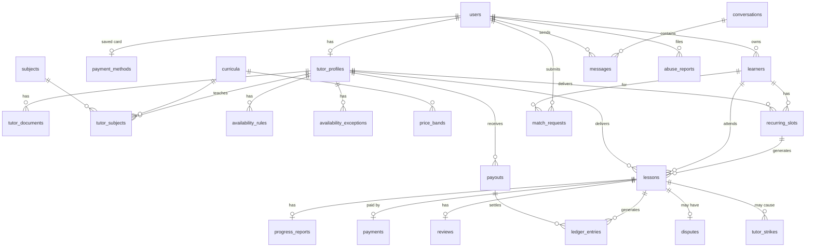

# DATA MODEL — v1.1

_All money columns are integer fils (AED). All timestamps UTC unless stated. Soft deletes only where noted._

## ERD



## Tables

### users
`id, role (enum: account_owner|tutor|admin), name, email (unique), phone, timezone (default Asia/Dubai), password, email_verified_at, status (active|suspended), suspended_reason, last_login_at, timestamps, deleted_at`

### learners
`id, account_user_id (fk users), display_name, is_minor (bool), year_group (string), curriculum_id (fk), school (nullable), notes (text), timestamps, deleted_at`
- An adult student has one learner row with `is_minor=false` and `display_name` = their own name.

### payment_methods
`id, account_user_id (fk, unique — one card in v1), gateway, gateway_customer_ref, gateway_token, brand, last4, exp_month, exp_year, status (active|expired|failed), last_failed_at, timestamps`
- Never store PAN. Token only.

### tutor_profiles
`id, user_id (fk, unique), headline, bio, intro_video_url, hourly_rate (fils), status (enum: draft|pending_review|changes_requested|approved|rejected|suspended), permit_number, permit_expires_at (date), id_verified_at, police_clearance_verified_at, qualifications_verified_at, agreement_accepted_at, rating_avg (decimal), rating_count, lessons_completed, late_report_count_90d, strike_count_90d, review_note (admin → tutor), approved_by (fk users), approved_at, timestamps`
- **Bookable** = `status = approved AND permit_expires_at > today`. Expose as a query scope `bookable()`; never re-implement the condition.

### tutor_documents
`id, tutor_profile_id, type (enum: permit|id|qualification|police_clearance), disk_path (private), original_name, status (pending|accepted|rejected), reviewed_by, reviewed_at, timestamps`

### curricula
`id, code (GCSE|A_LEVEL|IB_MYP|IB_DP|CBSE), name, sort`

### subjects
`id, name (Mathematics, Physics, English Language, …), slug, sort`

### tutor_subjects
`id, tutor_profile_id, curriculum_id, subject_id, level_min (string), level_max (string), level_tier (enum: lower_secondary|exam_1|exam_2)` · unique (tutor, curriculum, subject)

### price_bands
`id, curriculum_id, level_tier, min_rate (fils), max_rate (fils), effective_from` · unique (curriculum, tier, effective_from)

### availability_rules
`id, tutor_profile_id, weekday (0–6), start_time, end_time, timezone`  — weekly template in tutor local time; converted to UTC when computing slots

### availability_exceptions
`id, tutor_profile_id, date, start_time, end_time, type (blocked|extra)`

### recurring_slots
```
id, learner_id, tutor_profile_id, curriculum_id, subject_id,
weekday (0–6), start_time (local), timezone,
starts_on (date), ends_on (date, nullable),
status (enum: active|paused|ended),
paused_reason (nullable: payment_failed|admin), ended_by_user_id, ended_at, end_effective_on,
consecutive_charge_failures (int),
generated_until (date),
created_by_user_id, timestamps
```
- unique partial index `(tutor_profile_id, weekday, start_time, timezone) WHERE status = 'active'`.
- An `active` slot blocks that weekday/time in `SlotCalculator` indefinitely, not just up to `generated_until`.

### lessons
```
id, type (enum: trial|regular), recurring_slot_id (nullable),
learner_id, tutor_profile_id, booked_by_user_id, curriculum_id, subject_id,
starts_at (utc), ends_at (utc), duration_minutes (=60),
price (fils), commission_pct (frozen), commission_amount, tutor_amount,
cancel_window_hours (frozen), student_grace_min (frozen), tutor_grace_min (frozen),
status (enum — see state machine),
payment_method_id (nullable), charge_attempts (int), next_charge_at (nullable),
room_provider, room_id, tutor_join_url, learner_join_url, room_created_at,
tutor_joined_at, learner_joined_at, room_closed_at,
completed_at, cancelled_at, cancelled_by_user_id, cancel_reason,
report_due_at, escrow_released_at,
timestamps
```
- Indexes: `(tutor_profile_id, starts_at)`, `(learner_id, starts_at)`, `(status)`, `(report_due_at)`, `(next_charge_at) WHERE status = 'reserved'`.
- Unique partial index `(learner_id, tutor_profile_id) WHERE type = 'trial' AND status NOT IN (cancelled states)` — one trial per pair.
- Overlap protection: unique partial index on `(tutor_profile_id, starts_at) WHERE status NOT IN ('expired','cancelled_by_parent','cancelled_by_tutor','cancelled_payment_failed','refunded')` plus a transactional check in `BookLesson`.

### progress_reports
`id, lesson_id (unique), tutor_profile_id, topics_covered, went_well, work_on_next, homework, engagement (1–5), trial_suitability (nullable enum: good_fit|partial_fit|not_a_fit), trial_recommended_frequency (nullable int 1–3), trial_focus_areas (nullable text), submitted_at, emailed_at, timestamps`
- Trial fields required when `lesson.type = trial`, forbidden otherwise (Form Request rule).

### payments
`id, lesson_id, payer_user_id, payment_method_id (nullable), gateway (string), gateway_ref, amount, currency (AED), status (pending|captured|failed|refunded|partially_refunded), refunded_amount, failure_reason, raw_response (json), timestamps`

### ledger_entries  (append-only — never updated or deleted)
`id, lesson_id (nullable), payout_id (nullable), dispute_id (nullable), account (enum: escrow|tutor|platform|refund), tutor_profile_id (nullable), type (enum: hold|release_tutor|release_commission|refund|goodwill|payout), amount (signed fils), memo, created_by_user_id (nullable), created_at`
- Invariant: for any lesson, sum of all entries across accounts = 0 after every transaction.
- `platform` may go negative on a single lesson (goodwill refund). That is allowed and expected.

**Tutor balance buckets** (derived, never stored as a single number):
| Bucket | Definition |
|---|---|
| Pending | Σ `tutor_amount` of lessons in `confirmed`, `in_progress`, `completed` (not yet released) |
| On hold | Σ `tutor_amount` of lessons in `disputed` |
| Available | Σ ledger `tutor` account entries not linked to a payout |
| Processing | Σ ledger `tutor` entries linked to a payout with status `pending` |
| Paid to date | Σ `payout` type entries where payout status `paid` |

### payouts
`id, tutor_profile_id, period_start, period_end, amount, status (pending|paid|failed), bank_reference (required to reach `paid`), paid_at, created_by, timestamps`

### reviews
`id, lesson_id (unique), tutor_profile_id, account_user_id, rating (1–5), comment, published_at, timestamps`

### disputes
`id, lesson_id (unique), opened_by_user_id, reason (enum: no_show|quality|technical|other), description, status (open|resolved), parent_refund_pct (0–100), tutor_pay_pct (0–100), refund_amount, tutor_paid_amount, platform_delta (signed), admin_note, resolved_by, resolved_at, timestamps`

### abuse_reports
`id, reporter_user_id, subject_type (tutor_profile|user|lesson|conversation), subject_id, reason (enum: safety|contact_sharing|conduct|other), description, status (open|reviewing|closed), action_taken (nullable text), handled_by, closed_at, timestamps`

### tutor_strikes
`id, tutor_profile_id, lesson_id, type (late_cancel|no_show|late_report_x3|admin), note, created_at`

### match_requests
`id, account_user_id, learner_id, curriculum_id, subject_id, year_group, goals, preferred_times, budget_tier, status (open|suggested|closed), suggested_tutor_ids (json), handled_by, suggested_at, timestamps`

### conversations
`id, account_user_id, tutor_profile_id, first_lesson_completed_at (nullable), last_message_at, timestamps` · unique (account_user_id, tutor_profile_id)
- This pair is also the natural home for a future "learning relationship" record if v2 ever needs one. Do not add it now.

### messages
`id, conversation_id, sender_user_id, body, body_masked (bool), read_at, created_at`

### settings  (key/value, cached)
`commission_pct=25, trial_discount_pct=50, cancel_window_hours=24, student_grace_min=15, tutor_grace_min=10, report_due_hours=24, auto_release_hours=72, payout_weekday=1, payout_min=20000, booking_min_lead_hours=12, booking_max_days=30, recurring_horizon_weeks=4, recurring_charge_lead_hours=48, recurring_retry_hours=[36,24], recurring_pause_after_failures=2, recurring_tutor_end_notice_days=7, vat_pct=5`

### audit_logs
`id, actor_user_id, action, subject_type, subject_id, before (json), after (json), created_at`

---

## Lesson state machine

```mermaid
stateDiagram-v2
    [*] --> pending_payment : single booking created
    [*] --> reserved : generated from weekly slot
    pending_payment --> confirmed : payment captured → HOLD
    pending_payment --> expired : not paid in 15 min

    reserved --> confirmed : auto-charge captured (T-48h) → HOLD
    reserved --> cancelled_payment_failed : 3 failed charge attempts
    reserved --> cancelled_by_parent : parent skips (free)
    reserved --> cancelled_by_tutor : tutor skips (free; strike if <24h)

    confirmed --> cancelled_by_parent : parent cancels
    confirmed --> cancelled_by_tutor : tutor cancels → REFUND, strike if <24h
    confirmed --> in_progress : first party joins room
    confirmed --> no_show_both : nobody joined by end → REFUND
    confirmed --> provider_failure : admin marks outage → REFUND, no strike

    in_progress --> completed : scheduled end passed, both joined
    in_progress --> no_show_student : tutor marks after grace → tutor paid
    in_progress --> no_show_tutor : parent marks after grace → REFUND, strike

    completed --> completed_reported : report submitted → RELEASE
    completed --> completed_reported : 72h auto-release, late flag
    completed --> disputed : dispute within 48h (release paused)
    completed_reported --> disputed : dispute within 48h
    disputed --> settled : admin resolves (two dials) → SETTLE

    cancelled_by_parent --> refunded : was confirmed and ≥24h → REFUND
    cancelled_by_parent --> completed_reported : was confirmed and <24h → RELEASE
```



Terminal states: `expired, refunded, settled, completed_reported, cancelled_payment_failed, provider_failure`; `no_show_student` auto-advances to `completed_reported`, `no_show_tutor` and `no_show_both` auto-advance to `refunded`, `cancelled_*` from `reserved` are terminal with no money movement.

**Ledger effect per transition** (the only places money moves):

| Op | Entries |
|---|---|
| HOLD | escrow +price |
| RELEASE | escrow −price · tutor +tutor_amount · platform +commission_amount |
| REFUND (full) | escrow −price · refund +price |
| SETTLE (dispute: refund r = price × parent_refund_pct, tutor t = tutor_amount × tutor_pay_pct) | escrow −price · refund +r · tutor +t · platform +(price − r − t) — may be negative (`goodwill` type) |
| PAYOUT | tutor −amount · (bank) |

Rule: `sum(ledger_entries.amount) WHERE lesson_id = X` must equal 0 after every transition. Assert in tests and in a nightly `ledger:verify` command.

## Recurring slot generation

- Nightly job `recurring:generate` extends every `active` slot to `today + recurring_horizon_weeks`, creating `reserved` lessons in the slot's local time converted to UTC, skipping any occurrence that collides with an existing lesson or a tutor `blocked` exception (those occurrences are recorded as skipped, parent emailed).
- Hourly job `recurring:charge` charges every `reserved` lesson whose `next_charge_at <= now()`. Success → `confirmed`. Failure → increment `charge_attempts`, set `next_charge_at` to the next retry offset, email parent. After the last retry → `cancelled_payment_failed`, increment `consecutive_charge_failures` on the slot; at the threshold → slot `paused`. A successful charge resets the counter.
- Both jobs are idempotent: generation keys on `(recurring_slot_id, starts_at)`, charging uses the lesson id as the gateway idempotency key.
